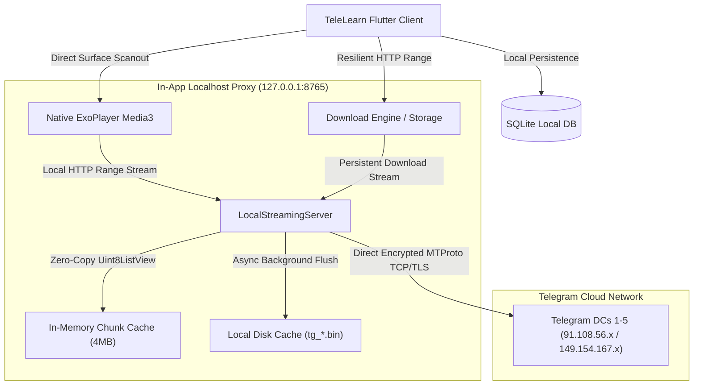

# 📱 TeleLearn App (Android / Flutter)

> Pure client-side, high-performance video learning application that directly transforms any Telegram Channel or Forum into a structured, distraction-free educational experience with offline study, ultra-smooth 60 FPS playback, and resilient downloads. **Requires zero external backend servers.**

[](https://flutter.dev)
[](https://dart.dev)
[](https://developer.android.com)
[](https://developer.android.com/media/media3/exoplayer)
[](https://sqlite.org)
[](https://telegram.org)
[](file:///d:/Projects/TeleLearn/App/build/app/outputs/flutter-apk/app-arm64-v8a-release.apk)

---

## ✨ Key Features & Highlights

### 🎬 60 FPS Hardware-Accelerated Video Player
- **🚀 Direct Hardware Overlay Scanout**: Bypasses GPU compositing copies using direct `RepaintBoundary` rendering, saving over **80 MB VRAM** and delivering butter-smooth 60 FPS playback with zero dropped frames.
- **⚡ Zero-Copy Stream Engine**: Leverages `Uint8List.sublistView()` zero-copy slicing to pipe network buffers straight into ExoPlayer with **0 heap allocation churn**.
- **⚡ 3-Chunk Parallel Lookahead Pipeline**: Automatically prefetches 768 KB to 1.5 MB ahead directly in RAM, eliminating buffering stalls at `1.0x` – `3.0x` playback speeds.
- **💾 Asynchronous Disk Caching (0ms Repeat Load)**: Asynchronously stores chunks to disk with non-blocking OS page cache writes (`flush: false`), enabling instant 0ms resumption when replaying lectures.
- **⏯️ Instant Autoplay & Minimal Pause-on-Tap Loader**: Tapping any lesson starts streaming immediately. While connecting, a clean 60×60 circular loader lets you pause/resume network loading on demand.
- **🛡️ 100% Zero-Audio-Leak Guarantee**: Synchronously pauses controllers and disconnects stream epochs on screen exit or app minimization (`AppLifecycleState.paused / inactive / hidden / detached`).
- **🔄 Intelligent Submodule Back Navigation**: Exiting a video started from the Dashboard returns directly to that module's video list in `CourseExplorerScreen`.

### 📥 Resilient Background Download Manager
- **🚀 High-Speed Direct Streams**: Downloads video lectures and course PDFs at full connection bandwidth directly from Telegram Cloud DCs.
- **🛡️ Uninterrupted Background Execution**: Active downloads are explicitly protected from video player epoch cancellations and continue running smoothly while navigating or watching other lectures.
- **📍 Exact Byte-Offset Continuation**: Resumes paused or network-interrupted downloads precisely from the last received byte (`Range: bytes=OFFSET-`) without restarting from 0%.
- **📄 Offline PDF Notes Viewer**: Built-in PDF reader with offline caching and study document generation.

### 📊 Real-Time Daily Study Analytics & Auto-Updating Shelf
- **🔥 Active Daily Streak & Study Analytics**: SQLite-backed activity tracking displaying today's study time, total hours, and streak counter.
- **⏯️ Real-Time "Continue Watching" Shelf**: Automatically updates your last-watched lesson, exact position, and percentage on the Dashboard without requiring a pull-to-refresh.
- **✅ Debounced Completion Tracker**: Automatically marks lessons complete at $\ge 90\%$ watched with debounced single-write persistence to prevent 60 FPS database thrashing.

### 🔄 Sequential Channel Importer
- **⚡ Non-Blocking FIFO Task Queue**: Multi-channel course synchronizations are queued sequentially (`_syncQueueLock`), maintaining a smooth 60 FPS UI without memory or CPU spikes during imports.

### 🎨 Modern Aesthetic Design System
- **🌙 Deep Midnight Dark Mode (`#0B1120`) & ☀️ Warm Light Mode (`#F8FAFC`)**.
- **Modern Typography**: Integrated Google Fonts (`Inter` for crisp UI readability and `Roboto Mono` for precise video timers).

---

## 🏗️ Pure Local MTProto Architecture



---

## 🛠️ Tech Stack & Dependencies

| Category | Technology | Purpose |
| :--- | :--- | :--- |
| **Framework** | Flutter 3.24+ / Dart 3.5+ | Cross-platform high-performance compilation |
| **Video Engine** | `video_player` (Media3 ExoPlayer) | Hardware direct-scanout video playback |
| **MTProto Protocol** | Direct Socket TCP/TLS | Client-side Telegram authentication & file streaming |
| **Local Proxy Server** | `dart:io` `HttpServer` (`127.0.0.1:8765`) | In-app byte-range streaming & lookahead pipeline |
| **State Management** | `provider` | Reactive, decoupled state synchronization |
| **Local Database** | `sqflite` + `path_provider` | Persistent offline progress, bookmarks & downloads |
| **Typography** | `google_fonts` | Inter & Roboto Mono typeface rendering |
| **Security** | `flutter_secure_storage` | Secure encrypted credential and session storage |

---

## 📁 Project Directory Structure

```
App/
├── android/                   # Native Android host configuration & build scripts
├── assets/                    # Static brand logos, icons, and placeholder assets
├── lib/
│   ├── core/                  # Design tokens, theme palettes, and app constants
│   ├── data/
│   │   ├── local_db/          # SQLite database schema, migrations & study metrics
│   │   ├── models/            # Course, Lesson, Module, Bookmark & Download models
│   │   └── services/          # LocalStreamingServer, TelegramAuthService & ImportService
│   ├── presentation/
│   │   ├── screens/
│   │   │   ├── auth/          # Telegram phone login & OTP verification screen
│   │   │   ├── course/        # Course explorer, channel browser & syllabus view
│   │   │   ├── dashboard/     # Home dashboard, streak tracker & continue watching
│   │   │   ├── downloads/     # Active download progress, speeds, ETAs & offline shelf
│   │   │   ├── player/        # Fullscreen YouTube/Cinema video player with HUDs
│   │   │   └── bookmarks/     # Saved lessons and study materials shelf
│   │   └── widgets/           # Reusable UI cards, badges, dialogs & app layouts
│   ├── providers/             # AuthProvider, CourseProvider, DownloadProvider, ProgressProvider
│   └── main.dart              # Application entry point & provider tree setup
├── test/                      # Comprehensive unit tests for database, formatting & models
└── pubspec.yaml               # Flutter project configuration and package dependencies
```

---

## 🚀 Getting Started

### 1. Prerequisites
- **Flutter SDK**: 3.24.0 or higher ([Install Flutter](https://docs.flutter.dev/get-started/install))
- **Android Studio / Android SDK**: API Level 26 (Android 8.0) up to API Level 35 (Android 15)
- **Java JDK**: 17+

### 2. Installation
```bash
# Clone the repository
git clone https://github.com/your-username/TeleLearn.git
cd TeleLearn/App

# Install Flutter dependencies
flutter pub get
```

### 3. Run in Debug Mode
Connect your Android phone via USB (with USB Debugging enabled) or start an Android emulator:
```bash
flutter run
```

### 4. Code Quality & Analysis
```bash
flutter analyze
```

---

## 📦 Building Production Release APKs

To generate optimized, split-ABI production release APKs with maximum performance:

```bash
flutter build apk --release --split-per-abi
```

### Output Binaries (`build/app/outputs/flutter-apk/`):
- **`app-arm64-v8a-release.apk`** (~24.2 MB) — Recommended for modern 64-bit Android phones (Samsung, Xiaomi, Vivo, Oppo, Pixel, OnePlus).
- **`app-armeabi-v7a-release.apk`** (~22.3 MB) — For older 32-bit Android smartphones.
- **`app-x86_64-release.apk`** (~25.4 MB) — For Android emulators and ChromeOS tablets.

### 📲 Install via ADB:
```bash
adb install -r build/app/outputs/flutter-apk/app-arm64-v8a-release.apk
```

---

## 📄 License
MIT License. Built for educational and productivity purposes.
