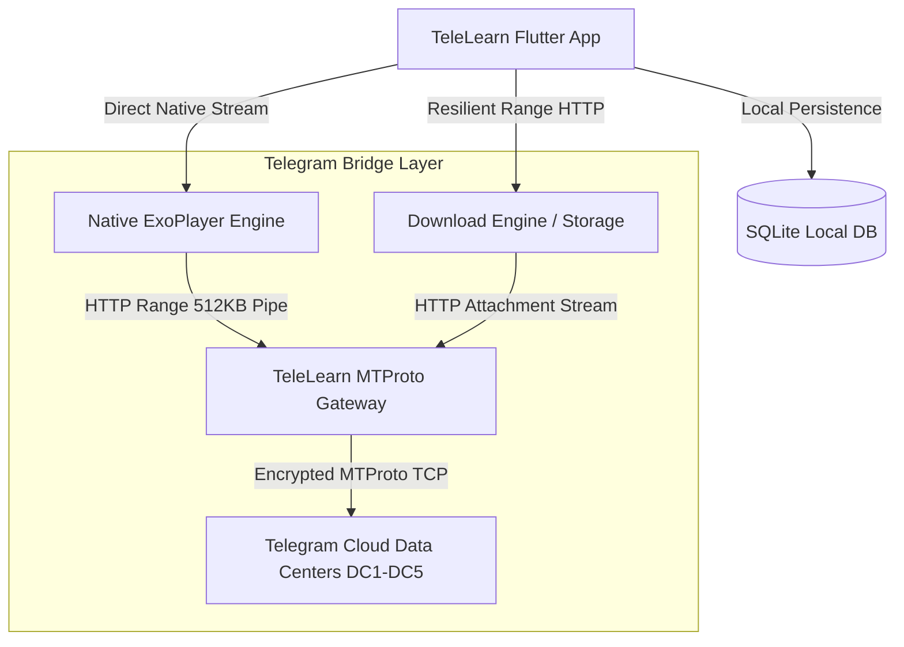

# 📱 TeleLearn App (Android / Flutter)

> Native, high-performance video learning application that transforms any Telegram Channel or Forum into a structured educational experience with offline study, ultra-smooth playback, and resilient downloads.

[](https://flutter.dev)
[](https://dart.dev)
[](https://developer.android.com)
[](https://developer.android.com/media/media3/exoplayer)
[](https://sqlite.org)
[](https://pub.dev/packages/provider)
[](file:///d:/Projects/TeleLearn/App/build/app/outputs/flutter-apk/app-arm64-v8a-release.apk)

---

## ✨ Key Features

### 🎬 Native Cinema-Grade Video Player
- **🖼️ Instant 0ms Standby Banner**: When opening any lecture, the player opens **instantly with zero black-screen lag or socket blocking**, displaying the high-res poster image, lesson overview, and a glowing center Play button.
- **⚡ High-Throughput 2X/3X Playback**: Optimized 512 KB MTProto packet pipelining eliminates buffering and stuttering at high playback speeds (`1.0x` – `3.0x`).
- **⏱️ Silky 60 FPS Scrubber & Monospace Timestamps**: Powered by an isolated `ValueListenableBuilder<VideoPlayerValue>` to ensure timeline and time indicators glide smoothly without causing full-page re-renders.
- **🔍 Pinch-to-Zoom (up to 4.5x)**: Smooth multi-touch pan and zoom for examining small handwriting and complex diagrams on blackboard lectures.
- **⚡ Long-Press Turbo Boost**: Long-press anywhere on the video player for instant 2x speed boost with dynamic HUD indicator.
- **🔄 Dual-Orientation Switching**: Smooth portrait-to-landscape toggle with a 1-tap **Flip Landscape** button for comfortable left/right viewing.
- **🔒 Screen Lock Mode**: Prevents accidental touches and hides gesture HUDs while watching in bed or on the go.

### 📥 High-Speed Resilient Download Manager
- **🚀 Full-Bandwidth Telegram Channel**: Automatically routes downloads through high-throughput direct streams (`quality=high`) to saturate your Wi-Fi and 5G connections.
- **🛡️ Auto-Recovery & Network Resilience**: Automatically recovers from Wi-Fi $\leftrightarrow$ Mobile Data drops with a 5-attempt retry engine and exponential backoff.
- **📍 Exact Byte-Offset Continuation**: Resuming a paused download continues precisely from the last received byte (`Range: bytes=EXACT_BYTES-`) without restarting from 0%.
- **⏱️ Real-Time Speed & Browser-Style ETA**: Displays live download speed (e.g. `3.8 MB/s`) and dynamic time-remaining countdown (e.g. `42s left`).
- **📄 Offline PDF Notes Generator**: Automatically formats and builds compliant standard PDF 1.4 documents from study text and notes for offline reading.

### 📊 Daily Study Streak & Analytics
- **🔥 Active Daily Streak**: SQLite-backed daily study activity tracking with interactive streak badge.
- **⏳ Live Progress Tracking**: Tracks total hours studied, today's study time, and per-lesson progress with automatic completion marking (>= 90% watched).
- **⏯️ Instant "Continue Watching" Shelf**: Displays your last-watched lesson on the home dashboard and resumes immediately at the saved timestamp.

### 🎨 Modern Aesthetic Design System
- **🌙 Deep Midnight Dark Mode (`#0B1120`) & ☀️ Warm Light Mode (`#F8FAFC`)**.
- **Modern Typography**: Integrated Google Fonts (`Inter` for UI clarity and `Roboto Mono` for precise video timers).
- **Responsive Navigation**: Adaptive bottom navigation bar with smooth screen transitions and haptic feedback.

---

## 🏗️ System Architecture



---

## 🛠️ Tech Stack & Dependencies

| Category | Technology | Purpose |
| :--- | :--- | :--- |
| **Framework** | Flutter 3.24+ / Dart 3.5+ | Cross-platform native compilation |
| **Video Engine** | `video_player` (ExoPlayer) | Hardware-accelerated native media playback |
| **State Management** | `provider` | Reactive, decoupled state synchronization |
| **Local Database** | `sqflite` + `path_provider` | Persistent offline progress, bookmarks & downloads |
| **Networking** | `http` | Resumable streaming, chunk downloading & REST APIs |
| **Typography** | `google_fonts` | Inter & Roboto Mono typeface rendering |
| **Security** | `flutter_secure_storage` | Secure credential and token persistence |

---

## 📁 Project Structure

```
App/
├── android/                   # Native Android host configuration & build scripts
├── assets/                    # Static brand logos, icons, and placeholder assets
├── lib/
│   ├── core/                  # Design tokens, theme palettes, and app constants
│   ├── data/
│   │   ├── local_db/          # SQLite database schema, migrations & CRUD operations
│   │   ├── models/            # Course, Lesson, Module, Bookmark & Download models
│   │   └── services/          # Telegram auth, import service & local stream server
│   ├── presentation/
│   │   ├── screens/
│   │   │   ├── auth/          # Telegram phone login & OTP verification screen
│   │   │   ├── course/        # Course explorer, channel browser & syllabus view
│   │   │   ├── dashboard/     # Home dashboard, streak tracker & continue watching
│   │   │   ├── downloads/     # Active download progress, speeds, ETAs & offline shelf
│   │   │   ├── player/        # Fullscreen YouTube/Cinema video player with HUDs
│   │   │   ├── profile/       # User profile, statistics & theme customization
│   │   │   └── bookmarks/     # Saved lessons and study materials shelf
│   │   └── widgets/           # Reusable UI cards, badges, dialogs & app layouts
│   ├── providers/             # AuthProvider, CourseProvider, DownloadProvider, ProgressProvider
│   └── main.dart              # Application entry point & provider tree setup
├── test/                      # Comprehensive unit tests for database, formatting & models
└── pubspec.yaml               # Flutter project configuration and package dependencies
```

---

## 🚀 Getting Started

### 1. Prerequisites
- **Flutter SDK**: 3.24.0 or higher ([Install Flutter](https://docs.flutter.dev/get-started/install))
- **Android Studio / Android SDK**: API Level 26 (Android 8.0) up to API Level 34 (Android 14)
- **Java JDK**: 17+

### 2. Installation
```bash
# Clone the repository
git clone https://github.com/your-username/TeleLearn.git
cd TeleLearn/App

# Install Flutter dependencies
flutter pub get
```

### 3. Run in Debug Mode
Connect your Android phone via USB (with USB Debugging enabled) or start an Android emulator:
```bash
flutter run
```

### 4. Run Automated Test Suite
```bash
flutter test test/app_unit_test.dart test/database_unit_test.dart
```

---

## 📦 Building the Production Release APK

To create the optimized, lightweight release APK (under **21 MB**) targeted for modern 64-bit Android smartphones:

```bash
flutter build apk --release --split-per-abi
```

### Generated Artifacts (`build/app/outputs/flutter-apk/`):
- **`app-arm64-v8a-release.apk`** (~20.4 MB) — Recommended for modern smartphones (Redmi, Samsung Galaxy, OnePlus, Pixel, etc.)
- **`app-armeabi-v7a-release.apk`** (~18.0 MB) — For older 32-bit Android devices.

### 📲 Install via ADB:
```bash
adb install -r build/app/outputs/flutter-apk/app-arm64-v8a-release.apk
```

---

## 📄 License
MIT License. Built for educational and productivity purposes.
