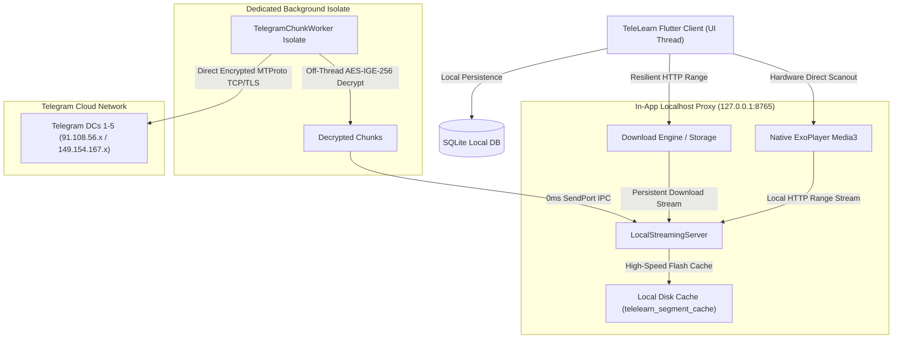

# 📱 TeleLearn App (Android / Flutter)

> Pure client-side, high-performance video learning application that directly transforms any Telegram Channel or Forum into a structured, distraction-free educational experience with offline study, ultra-smooth 60 FPS playback, and resilient downloads. **Requires zero external backend servers.**

[](pubspec.yaml)
[](https://flutter.dev)
[](https://dart.dev)
[](https://developer.android.com)
[](https://developer.android.com/media/media3/exoplayer)
[](https://sqlite.org)
[](https://github.com/7830-c/TeleLearn_Mobile_App)
[](file:///d:/Projects/TeleLearn/App/build/app/outputs/flutter-apk/app-arm64-v8a-release.apk)

---

## ✨ Key Features & Highlights

### 🔍 Course Module & Lesson Search
- **Module Grid/List Search**: Quickly filter courses and sub-modules by topic or title with instantaneous results.
- **Deep Lesson & Note Search**: Search inside any module in real time across **Video Lessons** (title & summary) and **Notes & PDFs** (filename & text content).
- **Zero-Friction State**: Search queries reset automatically when switching between modules for a seamless study flow.

### 📌 Submodule Pinning
- **Top-Anchored Priority**: Pin important modules to keep them anchored at the very top of your modules list.
- **App-Theme Blue Aesthetics**: Clean, polished styling with royal blue (`#2563EB`) borders, pin icons, and `📌 Pinned` badges matching TeleLearn's signature theme.
- **Persistent Local SQLite Storage**: Pinned states are saved permanently in SQLite and reload automatically on app restarts.
- **Tactile Haptic Feedback**: Tapping pin/unpin gives an instant, satisfying vibration response and confirmation snackbar.

### ⚡ 0ms Single-Click Action Buttons
- **Instant Response**: "Bookmark" and "Mark Done" buttons respond instantly on a single click with reactive `Consumer2` listeners.
- **Tactile Haptic Feedback**: Every button press triggers a light tactile vibration (`HapticFeedback.lightImpact()`) for physical confirmation.
- **Zero Stale State**: Both the action buttons and the video header status badges update simultaneously in real time.

### 🔄 In-App Self-Updating System (GitHub Releases OTA)
- **Automatic Background Checks**: Checks for updates once every 24 hours with zero unnecessary network calls or battery drain.
- **Manual "Check for Updates"**: Dedicated update checker inside the User Profile menu.
- **Live In-App Downloader**: Beautiful update modal displaying version comparison, GitHub release notes, file size, and a live MB / percentage progress bar.
- **Automatic Package Installer**: Automatically launches the Android native package installer once the APK download completes.

### 🎬 Ultra-Smooth 60–120 FPS Video Player
- **🚀 Dedicated Background Isolate AES-IGE Decryption (`TelegramChunkWorker`)**: Runs computationally heavy pure-Dart AES-IGE-256 decryption off the main thread in a persistent background worker isolate. Flutter's UI thread stays at 0% streaming load and renders at a locked 60–120 FPS with buttery soft touch controls.
- **🔄 Seamless Fullscreen & Orientation Autoplay**: Video keeps playing continuously without pausing when switching between portrait and fullscreen landscape, rotating the device, or flipping orientations.
- **📲 Non-Interrupted Playback on Control Center / Quick Settings**: Pulling down the notification shade, quick settings, or MIUI/HyperOS Control Center no longer pauses the video, allowing uninterrupted listening and viewing.
- **⚡ Zero-Copy Stream Engine**: Leverages `Uint8List.sublistView()` zero-copy slicing to pipe network buffers straight into ExoPlayer with **0 heap allocation churn**.
- **⚡ Lookahead Pipeline & Flash Disk Virtual Cache**: Prefetches ahead directly into high-speed flash disk storage (`telelearn_segment_cache`), keeping RAM usage minimal while enabling instant 0ms backward seek and lecture resumption.
- **⏯️ Instant Autoplay & Minimal Loader**: Tapping any lesson starts streaming immediately with visual buffering indicators and responsive HUD overlays.
- **🛡️ 100% Zero-Audio-Leak Guarantee**: Synchronously pauses controllers and disconnects stream epochs on screen exit or genuine app minimization.
- **🔄 Intelligent Submodule Back Navigation**: Exiting a video started from the Dashboard returns directly to that module's video list in `CourseExplorerScreen`.

### 📥 Resilient Background Download Manager
- **🚀 Rock-Solid 256 KB MTProto Chunks**: Uses Telegram's universally compliant 256 KB chunk size, eliminating `LIMIT_INVALID` RPC errors and ensuring 100% reliability for both course notes and multi-hundred-megabyte video lectures.
- **⚡ Oscillation-Free Pipelining (512 KB In-Flight)**: Implements a 2-chunk lookahead sliding window (`N+1`, `N+2`) with persistent worker sockets. Completely eliminates speed drop/spike oscillation cycles by preserving open TCP sockets across requests.
- **⚡ Zero-Delay Direct Streaming & Socket `tcpNoDelay`**: Eliminates Nagle algorithm buffering delays and bypasses player vsync pacing during active downloads so chunks stream continuously without artificial timer pauses.
- **🔄 Intelligent DC Auto-Migration**: Automatically detects and handles Telegram DC migration (`FILE_MIGRATE_X`) directly inside the background isolate worker, preserving socket sessions without disconnect cascades.
- **🛡️ Uninterrupted Background Execution & Dual-Route Fallback**: Active downloads run on independent stream IDs and feature automatic fallback to direct raw Telegram endpoints if proxy parameters need bypass.
- **💾 Single-Pass Flash I/O & Instant RAM Release**: Eliminates redundant writes to temporary segment cache during downloads, freeing each consumed chunk immediately from RAM.
- **📍 Exact Byte-Offset Continuation**: Resumes paused or network-interrupted downloads precisely from the last received byte (`Range: bytes=OFFSET-`) without restarting from 0%.
- **📄 Offline PDF Notes Viewer**: Built-in PDF reader with offline caching and study document generation.

### 📊 Real-Time Daily Study Analytics & Auto-Updating Shelf
- **🔥 Active Daily Streak & Study Analytics**: SQLite-backed activity tracking displaying today's study time, total hours, and streak counter.
- **⏯️ Real-Time "Continue Watching" Shelf**: Automatically updates your last-watched lesson, exact position, and percentage on the Dashboard.
- **✅ Debounced Completion Tracker**: Automatically marks lessons complete at $\ge 90\%$ watched with debounced single-write persistence to prevent database thrashing.

### 🔄 Clean Telegram Auth & Sequential Channel Importer
- **⚡ Streamlined Phone & OTP Login**: Clean, clutter-free authentication flow with auto-recovery for session handshakes.
- **⚡ Non-Blocking FIFO Task Queue**: Multi-channel course synchronizations are queued sequentially (`_syncQueueLock`), maintaining a smooth UI without memory or CPU spikes during imports.

### 🎨 Modern Aesthetic Design System
- **🌙 Deep Midnight Dark Mode (`#0B1120`) & ☀️ Warm Light Mode (`#F8FAFC`)**.
- **Modern Typography**: Integrated Google Fonts (`Inter` for crisp UI readability and `Roboto Mono` for precise video timers).

---

## 🏗️ Pure Local MTProto Architecture



---

## 🛠️ Tech Stack & Dependencies

| Category | Technology | Purpose |
| :--- | :--- | :--- |
| **Framework** | Flutter 3.24+ / Dart 3.5+ | Cross-platform high-performance compilation |
| **Video Engine** | `video_player` (Media3 ExoPlayer) | Hardware direct-scanout video playback |
| **MTProto Protocol** | Direct Socket TCP/TLS | Client-side Telegram authentication & file streaming |
| **Local Proxy Server** | `dart:io` `HttpServer` (`127.0.0.1:8765`) | In-app byte-range streaming & lookahead pipeline |
| **State Management** | `provider` | Reactive, decoupled state synchronization |
| **Local Database** | `sqflite` + `path_provider` | Persistent offline progress, bookmarks & downloads |
| **App Updater** | `package_info_plus` + `open_filex` | GitHub Releases OTA checking, streaming APKs & native install |
| **Typography** | `google_fonts` | Inter & Roboto Mono typeface rendering |
| **Security** | `flutter_secure_storage` | Secure encrypted credential and session storage |

---

## 📁 Project Directory Structure

```
App/
├── android/                   # Native Android host configuration & build scripts
├── assets/                    # Static brand logos, icons, and placeholder assets
├── lib/
│   ├── core/                  # Design tokens, theme palettes, and app constants
│   ├── data/
│   │   ├── local_db/          # SQLite database schema, migrations & study metrics
│   │   ├── models/            # Course, Lesson, Module, Bookmark & Download models
│   │   └── services/          # LocalStreamingServer, TelegramAuthService, ImportService & AppUpdateService
│   ├── presentation/
│   │   ├── screens/
│   │   │   ├── auth/          # Telegram phone login & OTP verification screen
│   │   │   ├── course/        # Course explorer with search, submodule pinning & syllabus view
│   │   │   ├── dashboard/     # Home dashboard, streak tracker & continue watching
│   │   │   ├── downloads/     # Active download progress, speeds, ETAs & offline shelf
│   │   │   ├── player/        # Fullscreen YouTube/Cinema video player with HUDs & instant actions
│   │   │   └── bookmarks/     # Saved lessons and study materials shelf
│   │   └── widgets/           # Reusable UI cards, badges, dialogs & app layouts
│   ├── providers/             # AuthProvider, CourseProvider, DownloadProvider, ProgressProvider
│   └── main.dart              # Application entry point & provider tree setup
├── test/                      # Comprehensive unit tests for database, formatting & models
└── pubspec.yaml               # Flutter project configuration and package dependencies
```

---

## 🚀 Getting Started

### 1. Prerequisites
- **Flutter SDK**: 3.24.0 or higher ([Install Flutter](https://docs.flutter.dev/get-started/install))
- **Android Studio / Android SDK**: API Level 26 (Android 8.0) up to API Level 35 (Android 15)
- **Java JDK**: 17+

### 2. Installation
```bash
# Clone the repository
git clone https://github.com/your-username/TeleLearn.git
cd TeleLearn/App

# Install Flutter dependencies
flutter pub get
```

### 3. Run in Debug Mode
Connect your Android phone via USB (with USB Debugging enabled) or start an Android emulator:
```bash
flutter run
```

### 4. Code Quality & Analysis
```bash
flutter analyze
```

---

## 📦 Building Production Release APKs

To generate optimized, split-ABI production release APKs with maximum performance:

```bash
flutter build apk --release --split-per-abi
```

### Output Binaries (`build/app/outputs/flutter-apk/`):
- **`app-arm64-v8a-release.apk`** (~24.2 MB) — Recommended for modern 64-bit Android phones (Samsung, Xiaomi, Vivo, Oppo, Pixel, OnePlus).
- **`app-armeabi-v7a-release.apk`** (~22.3 MB) — For older 32-bit Android smartphones.
- **`app-x86_64-release.apk`** (~25.4 MB) — For Android emulators and ChromeOS tablets.

### 📲 Install via ADB:
```bash
adb install -r build/app/outputs/flutter-apk/app-arm64-v8a-release.apk
```

---

## 📄 License
MIT License. Built for educational and productivity purposes.
